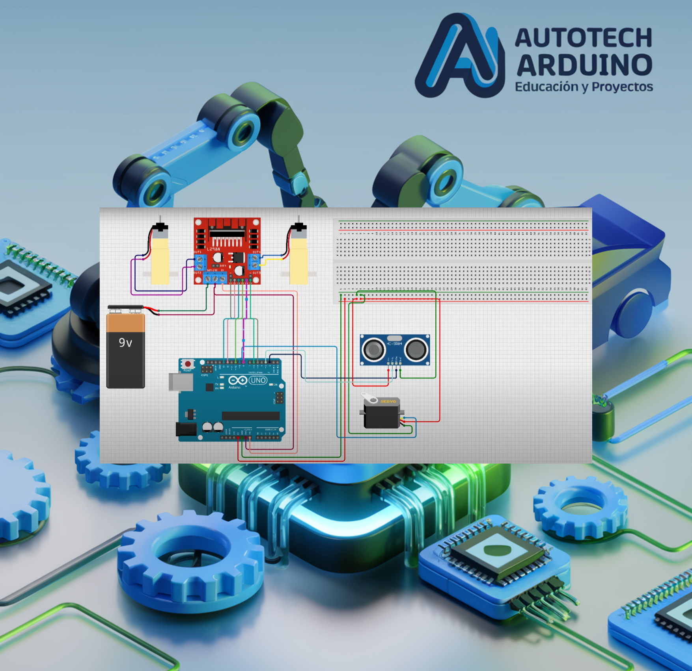

# 🏎️ Carrito Detector de Obstáculos con Arduino y Ultrasonido 🤖

¡Prepárate para construir tu propio robot móvil! En este proyecto avanzado, vamos a crear un **Carrito Detector de Obstáculos**. Utilizando un sensor ultrasónico montado sobre un servomotor, el carrito será capaz de "mirar" a su alrededor, detectar paredes o muebles y decidir hacia dónde girar para evitar colisiones. ¡Es una introducción perfecta al mundo de la robótica autónoma! 🚀

**Aprende a construir un robot autónomo que esquiva obstáculos utilizando sensores ultrasónicos, servomotores y controladores de motor puente H.**

## Introducción al Proyecto

El Carrito Detector es un clásico de la robótica educativa. Este proyecto te enseñará a integrar sensores de proximidad con el control de motores DC de alta potencia. Aprenderás lógica de navegación: el robot se detiene ante un obstáculo, escanea la derecha y la izquierda con el servo, y elige el camino con mayor espacio libre. ¡Un verdadero cerebro electrónico en movimiento!

## Componentes Necesarios

Para realizar este proyecto de robótica, necesitarás:

*   1 x Arduino Uno
*   1 x Sensor Ultrasónico HC-SR04
*   1 x Servo Motor (ej. SG90)
*   1 x Puente H L298N (Controlador de motores)
*   2 x Motores DC con Ruedas
*   1 x Chasis de robot (o cartón rígido para prototipo)
*   1 x Buzzer
*   1 x Soporte de baterías (4x AA o 1x 9V)
*   Cables de conexión y Protoboard

## Todos los materiales necesarios los encontrarás en los siguientes enlaces:

*   [Kit de Arduino Uno R3 - Incluye todo lo necesario](https://amzn.to/4dQTpkX)
*   [Kit de módulos de sensores y componentes - Compatible con Arduino](https://amzn.to/3yGZIsk)

## Configuración del Circuito

### Diagrama de Conexión

### Conexiones de Control:

*   **Sensor Ultrasónico:** Trig a **A0**, Echo a **A1**.
*   **Servomotor:** Pin de señal al **Pin 3**.
*   **Controlador de Motores L298N:**
    *   ENA, ENB (Velocidad): **Pin 5** y **6**.
    *   IN1, IN2 (Motor A): **Pin 8** y **9**.
    *   IN3, IN4 (Motor B): **Pin 10** y **11**.
*   **Buzzer:** Pin positivo al **Pin 12**.

## Código del Carrito Detector de Obstáculos

Copia y carga este código en tu Arduino IDE. Asegúrate de que las conexiones coincidan con los pines definidos al inicio del script.

    <button onclick="copyCode()" style="background-color: #007BFF; color: white; padding: 10px 20px; border: none; cursor: pointer; position: absolute; right: 10px; top: 10px; border-radius: 5px; font-weight: bold;">Copiar Código</button>
    <pre id="codeContent" style="margin-top: 40px; overflow-x: auto;"><code>
#include &lt;Servo.h&gt;

#define TRIG_PIN A0 
#define ECHO_PIN A1 
#define MAX_DISTANCE 200

Servo myservo; 
boolean goesForward = true;
int distance = 100;
int speedSet = 180; 

// Pines Puente H
const int ENA = 5;
const int IN1 = 8;
const int IN2 = 9;
const int ENB = 6;
const int IN3 = 10;
const int IN4 = 11;
const int BUZZER_PIN = 12;

void setup() {
  myservo.attach(3); 
  myservo.write(115); // Centro
  delay(2000);
  pinMode(ENA, OUTPUT);
  pinMode(IN1, OUTPUT);
  pinMode(IN2, OUTPUT);
  pinMode(ENB, OUTPUT);
  pinMode(IN3, OUTPUT);
  pinMode(IN4, OUTPUT);
  pinMode(TRIG_PIN, OUTPUT);
  pinMode(ECHO_PIN, INPUT);
  pinMode(BUZZER_PIN, OUTPUT);
}

void loop() {
  distance = readPing();

  if (distance &lt;= 25) { 
    tone(BUZZER_PIN, 1000);
    moveStop();
    delay(200);
    moveBackward();
    delay(800);
    moveStop();
    delay(200);
    int distanceR = lookRight();
    delay(200);
    int distanceL = lookLeft();
    delay(200);

    if (distanceR &gt;= distanceL) {
      turnRight();
      moveStop();
    } else {
      turnLeft();
      moveStop();
    }
  } else {
    noTone(BUZZER_PIN);
    moveForward();
  }
}

int lookRight() {
  myservo.write(50);
  delay(500);
  int d = readPing();
  delay(100);
  myservo.write(115);
  return d;
}

int lookLeft() {
  myservo.write(170);
  delay(500);
  int d = readPing();
  delay(100);
  myservo.write(115);
  return d;
}

int readPing() {
  digitalWrite(TRIG_PIN, LOW);
  delayMicroseconds(2);
  digitalWrite(TRIG_PIN, HIGH);
  delayMicroseconds(10);
  digitalWrite(TRIG_PIN, LOW);
  long duration = pulseIn(ECHO_PIN, HIGH);
  int d = duration * 0.034 / 2;
  return (d == 0) ? 250 : d;
}

void moveStop() {
  analogWrite(ENA, 0); analogWrite(ENB, 0);
}

void moveForward() {
  analogWrite(ENA, speedSet); digitalWrite(IN1, HIGH); digitalWrite(IN2, LOW);
  analogWrite(ENB, speedSet); digitalWrite(IN3, HIGH); digitalWrite(IN4, LOW);
}

void moveBackward() {
  analogWrite(ENA, speedSet); digitalWrite(IN1, LOW); digitalWrite(IN2, HIGH);
  analogWrite(ENB, speedSet); digitalWrite(IN3, LOW); digitalWrite(IN4, HIGH);
}

void turnRight() {
  analogWrite(ENA, speedSet); digitalWrite(IN1, HIGH); digitalWrite(IN2, LOW);
  analogWrite(ENB, speedSet); digitalWrite(IN3, LOW); digitalWrite(IN4, HIGH);
  delay(300); moveForward();
}

void turnLeft() {
  analogWrite(ENA, speedSet); digitalWrite(IN1, LOW); digitalWrite(IN2, HIGH);
  analogWrite(ENB, speedSet); digitalWrite(IN3, HIGH); digitalWrite(IN4, LOW);
  delay(300); moveForward();
}
</code></pre>

## Explicación de la Lógica

1.  **Lectura Ultrasónica (`readPing`)**: El sensor envía una onda de sonido. Midiendo el tiempo que tarda en volver, calculamos la distancia en centímetros.
2.  **Detección de Obstáculos**: Si la distancia es menor a 25 cm, el carrito se detiene y activa el buzzer para alertar.
3.  **Escaneo de Entorno**: El servomotor gira el sensor a la derecha (50°) y luego a la izquierda (170°). Arduino compara ambas distancias.
4.  **Toma de Decisión**: El carrito elige girar hacia el lado donde haya detectado mayor distancia libre.
5.  **Control de Motores**: Utilizamos funciones como `moveForward`, `turnRight`, etc., para simplificar el control del puente H L298N.

## Problemas Comunes y Soluciones

*   **El carrito gira en círculos:** Verifica que los cables de un motor no estén invertidos respecto al otro.
*   **No esquiva obstáculos:** Asegúrate de que las baterías tengan suficiente carga; los motores y el servo consumen mucha energía.
*   **Lecturas erráticas:** El sensor ultrasónico puede fallar ante superficies blandas (alfombras, telas) que absorben el sonido.

## Desafío para el Alumno

¿Cómo podrías modificar el proyecto para que, además de esquivar obstáculos, el carrito pueda ser controlado por Bluetooth cuando no detecte colisiones cercanas? ¡Imagina un modo híbrido!

<button onclick="toggleAnswer()" style="margin-top: 10px; background-color: #007BFF; color: white; padding: 10px; border: none; cursor: pointer; border-radius: 5px; font-weight: bold;">Mostrar Solución</button>

    
Podrías integrar un módulo Bluetooth HC-05 y usar la librería <code>SoftwareSerial</code> para recibir comandos. Aquí un esquema lógico:

    <pre id="solutionCodeContent" style="background-color: #f8f9fa; padding: 10px; border-radius: 5px; border: 1px solid #eee;"><code>
void loop() {
  distance = readPing();
  if (distance &lt;= 25) { 
    automataEsquivar(); // Función con la lógica actual
  } else {
    if (BT.available()) {
      char cmd = BT.read();
      ejecutarComandoBT(cmd); // Mover según el celular
    }
  }
}
</code></pre>
    <button onclick="copySolutionCode()" style="background-color: #007BFF; color: white; padding: 8px 16px; border: none; cursor: pointer; border-radius: 5px; margin-top: 10px; font-weight: bold;">Copiar Código de Solución</button>

¡Disfruta construyendo tu robot! La robótica avanzada te abre las puertas a crear máquinas inteligentes. ¡A programar! 🚀

