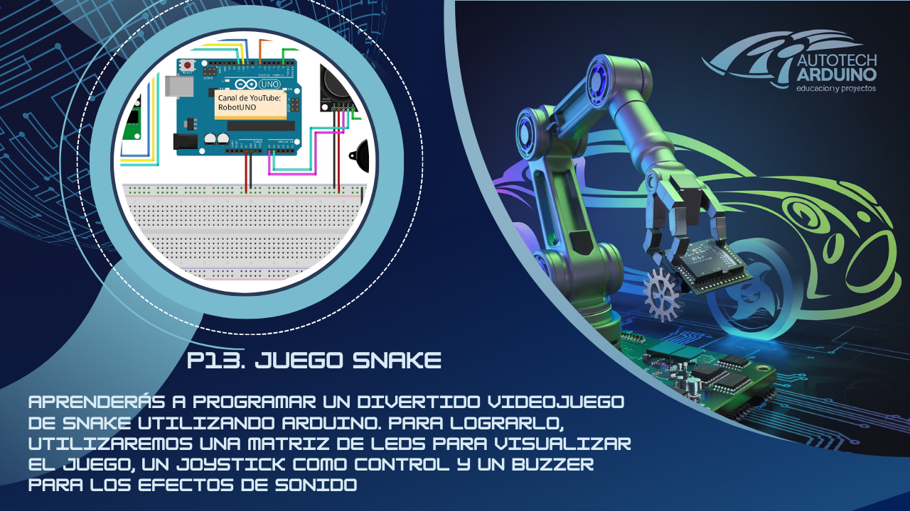

# 🐍 Juego Snake en una Pantalla LED 8x8 con Arduino 🕹️

¡Hola, entusiasta de la tecnología! Hoy te traigo un proyecto de nivel avanzado que combina diversión, lógica de programación y control de hardware: **Juego Snake con Matriz LED**. Este proyecto consiste en crear el popular juego utilizando una pantalla LED 8x8, un joystick y un buzzer. El objetivo es mover una "serpiente" por la pantalla para comer, aumentando su tamaño sin chocar con los bordes ni contigo mismo. ¡Es un reto emocionante para cualquier programador de Arduino! 🚀

**Aprende a programar el clásico juego de Snake en una matriz LED utilizando un joystick para el control de dirección y efectos de sonido con un buzzer.**

## Introducción al Proyecto

Este proyecto está diseñado para jóvenes que desean aprender mientras se divierten. A través de él, entenderás cómo gestionar coordenadas en una matriz, manejar entradas analógicas (Joystick) y crear efectos de sonido dinámicos. Es el punto de partida perfecto para crear tus propios videojuegos con hardware.

## Componentes Necesarios

Para llevar a cabo este proyecto, necesitarás los siguientes componentes:

*   1 x Arduino Uno
*   1 x Matriz LED 8x8 con Módulo MAX7219
*   1 x Joystick (Módulo KY-023)
*   1 x Buzzer
*   1 x Protoboard
*   Cables de conexión

## Todos los materiales necesarios los encontrarás en los siguientes enlaces:

*   [Kit de Arduino Uno R3 - Incluye todo lo necesario](https://amzn.to/4dQTpkX)
*   [Kit de módulos de sensores y componentes - Compatible con Arduino](https://amzn.to/3yGZIsk)

## Configuración del Circuito

### Diagrama de Conexión

### Conexiones Técnicas:

*   **Joystick:**
    *   Eje X (VRx) a **A0**.
    *   Eje Y (VRy) a **A1**.
    *   Botón (SW) a **D4**.
    *   VCC a **5V** y GND a **GND**.
*   **Matriz LED 8x8 (MAX7219):**
    *   DIN a pin **12**.
    *   CS a pin **11**.
    *   CLK a pin **10**.
    *   VCC a **5V** y GND a **GND**.
*   **Buzzer:**
    *   Positivo al pin **8**.
    *   Negativo a **GND**.

## Código del Juego Snake con Arduino

¡Es hora de programar el juego! Aquí tienes el código completo. Asegúrate de tener instalada la librería `LedControl.h`. Copia el código haciendo clic en el botón inferior.

    <button onclick="copyCode()" style="background-color: #007BFF; color: white; padding: 10px 20px; border: none; cursor: pointer; position: absolute; right: 10px; top: 10px; border-radius: 5px; font-weight: bold;">Copiar Código</button>
    <pre id="codeContent" style="margin-top: 40px; overflow-x: auto;"><code>
#include "LedControl.h"
#include <SoftwareSerial.h>

// Bluetooth (Opcional)
SoftwareSerial BT(2, 3); // RX, TX

// Pines
const int SW_pin = 4;
const int X_pin = A0;
const int Y_pin = A1;
const int DIN = 12;
const int CS = 11;
const int CLK = 10;
const int BUZZER = 8;

// Variables de Pantalla
const int screenWidth = 8;
const int screenHeight = 8;
int snakeX, snakeY, foodX, foodY, score = 0, snakeSize = 1; 
char direction = ' ';
int tailX[100], tailY[100];
bool isGameOver = false;

LedControl lc = LedControl(DIN, CLK, CS, 1);

void setup() {
  setupPins();
  setupLedBoard();
  setupSnakePosition();
  setupFoodPosition();
  Serial.begin(9600);
  BT.begin(9600);
}

void setupPins() {
  pinMode(SW_pin, INPUT);
  digitalWrite(SW_pin, HIGH);
  pinMode(BUZZER, OUTPUT);
}

void setupLedBoard() {
  lc.shutdown(0, false);
  lc.setIntensity(0, 1);
  lc.clearDisplay(0);
}

void setupSnakePosition() {
  snakeX = 4;
  snakeY = 4;
}

void setupFoodPosition() {
  foodX = random(screenWidth);
  foodY = random(screenHeight);
}

void loop() {
  if (isGameOver) {
    playGameOverSong();
    showGameOverScreen();
  } else {
    startGame();
  }
}

void playGameOverSong() {
  tone(BUZZER, 1000, 1000);
  delay(100);
  tone(BUZZER, 2000, 1000);
  delay(100);
  tone(BUZZER, 3000, 1000);
  delay(100);
  tone(BUZZER, 4000, 1000);
  delay(100);
  tone(BUZZER, 5000, 2000);
}

void playFoodEatenSong() {
  tone(BUZZER, 500, 100);
}

void startGame() {
  manageGameOver();
  setJoystickDirection();
  readBluetoothCommand();
  changeSnakeDirection();
  manageSnakeOutOfBounds();
  manageEatenFood();
  manageSnakeTailCoordinates();
  drawSnake();
  delay(300);
}

void manageGameOver() {
  for (int i = 1; i < snakeSize; i++) {
    if (tailX[i] == snakeX && tailY[i] == snakeY) {
      isGameOver = true;
    }
  }
}

void manageSnakeOutOfBounds() {
  if (snakeX >= screenWidth) snakeX = 0;
  else if (snakeX < 0) snakeX = screenWidth - 1;
  if (snakeY >= screenHeight) snakeY = 0;
  else if (snakeY < 0) snakeY = screenHeight - 1;
}

void manageSnakeTailCoordinates() {
  int previousX = tailX[0];
  int previousY = tailY[0];
  tailX[0] = snakeX;
  tailY[0] = snakeY;

  for (int i = 1; i < snakeSize; i++) {
    int prevX = tailX[i];
    int prevY = tailY[i];
    tailX[i] = previousX;
    tailY[i] = previousY;
    previousX = prevX;
    previousY = prevY;
  }
}

void manageEatenFood() {
  if (snakeX == foodX && snakeY == foodY) {
    playFoodEatenSong();
    score++;
    snakeSize++;
    setupFoodPosition();
  }
}

void setJoystickDirection() {
  if (analogRead(X_pin) > 1000) direction = 'r';
  else if (analogRead(X_pin) < 100) direction = 'l';
  else if (analogRead(Y_pin) > 1000) direction = 'u';
  else if (analogRead(Y_pin) < 100) direction = 'd';
}

void readBluetoothCommand() {
  while (BT.available()) {
    char command = BT.read();
    switch (command) {
      case 'F': direction = 'u'; break;
      case 'B': direction = 'd'; break;
      case 'L': direction = 'l'; break;
      case 'R': direction = 'r'; break;
    }
  }
}

void changeSnakeDirection() {
  switch (direction) {
    case 'l': snakeX--; break;
    case 'r': snakeX++; break;
    case 'u': snakeY--; break;
    case 'd': snakeY++; break;
  }
}

void showGameOverScreen() {
  for (int i = 0; i < screenHeight; i++) {
    for (int j = 0; j < screenWidth; j++) {
      showLed(j, i);
      delay(50);
    }
  }
  resetVariables();
}

void resetVariables() {
  setupSnakePosition();
  setupFoodPosition();
  direction = ' ';
  isGameOver = false;
  score = 0;
  snakeSize = 1;
}

void showLed(int row, int column) { lc.setLed(0, row, column, true); }
void hideLed(int row, int column) { lc.setLed(0, row, column, false); }

void drawSnake() {
  for (int i = 0; i < screenHeight; i++) {
    for (int j = 0; j < screenWidth; j++) {
      if (i == snakeY && j == snakeX) showLed(snakeX, snakeY);
      else if (i == foodY && j == foodX) showLed(foodX, foodY);
      else {
        bool isShown = false;
        for (int k = 0; k < snakeSize; k++) {
          if (tailX[k] == j && tailY[k] == i) {
            showLed(j, i);
            isShown = true;
          }
        }
        if (!isShown) hideLed(j, i);
      }
    }
  }
}
</code></pre>

## Explicación del Código

1.  **Librería LedControl:** Es fundamental para enviar los datos a través de tres pines (DIN, CLK, CS) y controlar cómodamente cada píxel de la matriz.
2.  **Lógica de Coordenadas:** La serpiente y la comida se representan como puntos (X, Y) en un plano 8x8. Usamos arreglos `tailX` y `tailY` para recordar dónde están todos los segmentos de la cola.
3.  **Movimiento:** El joystick lee valores analógicos (0 a 1023). Al inclinarlo, detectamos si el valor es muy bajo o muy alto para asignar una dirección ('l', 'r', 'u', 'd').
4.  **Crecimiento:** Cuando la serpiente tiene la misma coordenada que la comida, se aumenta `snakeSize`, se suma al `score` y se genera comida en un lugar nuevo.
5.  **Game Over:** Si las coordenadas de la cabeza coinciden con las de cualquier segmento de la cola, el juego activa la secuencia de fin de partida.

## Problemas Comunes y Soluciones

*   **La pantalla LED no enciende:** Revisa que el módulo MAX7219 esté recibiendo 5V y que los pines DIN, CS y CLK estén en los puertos correctos (12, 11 y 10).
*   **La serpiente se mueve sola o en dirección errónea:** Los joysticks pueden tener diferentes orientaciones. Si tu serpiente va arriba cuando inclinas abajo, simplemente intercambia los casos en `setJoystickDirection()`.
*   **El juego es muy lento o rápido:** Ajusta el valor del `delay(300)` al final de la función `startGame()`. Un número mayor hará el juego más fácil.

## Desafío para el Alumno

¿Cómo podrías modificar el proyecto para que la velocidad de la serpiente aumente automáticamente a medida que el puntaje (`score`) sube? ¡Dale dinamismo a tu videojuego!

<button onclick="toggleAnswer()" style="margin-top: 10px; background-color: #007BFF; color: white; padding: 10px; border: none; cursor: pointer; border-radius: 5px; font-weight: bold;">Mostrar Solución</button>

    
Puedes crear una variable para el retardo y restarle valor según el score:

    <pre id="solutionCodeContent" style="background-color: #f8f9fa; padding: 10px; border-radius: 5px; border: 1px solid #eee;"><code>
// Define una variable de velocidad
int gameDelay = 300;

// En startGame(), usa la variable en el delay
void startGame() {
  // ... resto del código ...
  int currentDelay = gameDelay - (score * 10);
  if (currentDelay < 100) currentDelay = 100; // Límite de velocidad
  delay(currentDelay);
}
</code></pre>
    <button onclick="copySolutionCode()" style="background-color: #007BFF; color: white; padding: 8px 16px; border: none; cursor: pointer; border-radius: 5px; margin-top: 10px; font-weight: bold;">Copiar Código de Solución</button>

¡Espero que disfrutes creando este videojuego tanto como yo compartiéndolo contigo! Sigue experimentando y mejorando tus habilidades con Arduino. ¡Nos vemos en el próximo nivel! 🚀

