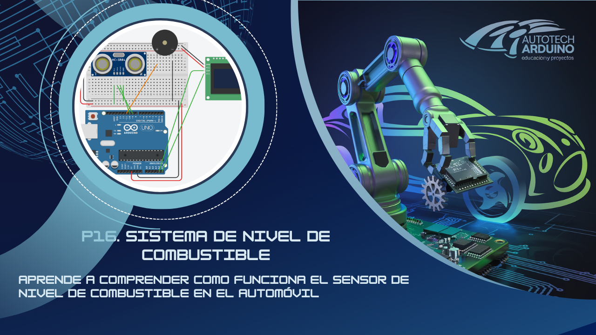

# ⛽ Sistema de Medición de Nivel de Combustible con Arduino 🌊

¡Aprende a monitorear recursos críticos! En este proyecto avanzado, construiremos un **Sistema de Medición de Nivel de Combustible** (simulado con un sensor de nivel de líquidos). El sistema muestra el porcentaje de llenado en una pantalla LCD y activa una alarma sonora cuando el nivel baja del 20%, simulando la reserva de un vehículo o un tanque industrial. ¡Una aplicación práctica esencial en el mundo de la ingeniería! 🚀

**Aprende a leer sensores analógicos de nivel, mapear valores a porcentajes y gestionar alertas visuales y sonoras con Arduino.**

## Introducción al Proyecto

La medición de niveles de líquidos es fundamental en la automatización. Este proyecto te enseñará a trabajar con sensores resistivos/analógicos, a calibrar lecturas para obtener porcentajes precisos y a utilizar pantallas LCD I2C para crear interfaces de usuario claras. ¡Es una base sólida para proyectos de domótica e industria!

## Componentes Necesarios

Para llevar a cabo este proyecto, necesitarás:

*   1 x Arduino Uno
*   1 x Sensor de Nivel de Agua / Líquidos (Analógico)
*   1 x Pantalla LCD 16x2 con Módulo I2C
*   1 x Buzzer
*   1 x Protoboard
*   Cables de conexión

## Todos los materiales necesarios los encontrarás en los siguientes enlaces:

*   [Kit de Arduino Uno R3 - Incluye todo lo necesario](https://amzn.to/4dQTpkX)
*   [Kit de módulos de sensores y componentes - Compatible con Arduino](https://amzn.to/3yGZIsk)

## Configuración del Circuito

### Diagrama de Conexión

### Conexiones Técnicas:

*   **Sensor de Nivel:** Señal (S) al Pin **A0**, VCC a 5V y GND a GND.
*   **Pantalla LCD I2C:** SDA al Pin **A4**, SCL al Pin **A5**.
*   **Buzzer:** Positivo al Pin **11**, Negativo a **GND**.

## Código del Sistema de Nivel de Combustible

Copia el código a continuación y cárgalo en tu placa Arduino. Asegúrate de que el sensor esté seco antes de iniciar para verificar la lectura de 0%.

    <button onclick="copyCode()" style="background-color: #007BFF; color: white; padding: 10px 20px; border: none; cursor: pointer; position: absolute; right: 10px; top: 10px; border-radius: 5px; font-weight: bold;">Copiar Código</button>
    <pre id="codeContent" style="margin-top: 40px; overflow-x: auto;"><code>
#include &lt;Wire.h&gt;
#include &lt;LiquidCrystal_I2C.h&gt;

// Configuración del sensor
#define WATER_SENSOR_PIN A0
#define MAX_WATER_LEVEL 1023  
#define MIN_WATER_LEVEL 0     

// Configuración del buzzer
#define BUZZER_PIN 11

// Pantalla LCD I2C (dirección 0x27)
LiquidCrystal_I2C lcd(0x27, 16, 2);

void setup() {
  lcd.init();
  lcd.backlight();
  lcd.setCursor(0, 0);
  lcd.print("Nivel de Comb:");

  pinMode(WATER_SENSOR_PIN, INPUT);
  pinMode(BUZZER_PIN, OUTPUT);

  Serial.begin(9600);
}

void loop() {
  int sensorValue = analogRead(WATER_SENSOR_PIN);

  // Limitar valores para evitar errores
  if (sensorValue < MIN_WATER_LEVEL) sensorValue = MIN_WATER_LEVEL;
  else if (sensorValue > MAX_WATER_LEVEL) sensorValue = MAX_WATER_LEVEL;

  // Mapear el valor analógico (0-1023) a porcentaje (0-100)
  int fuelLevel = map(sensorValue, MIN_WATER_LEVEL, MAX_WATER_LEVEL, 0, 100);

  lcd.setCursor(0, 1);
  lcd.print("Nivel: ");
  lcd.print(fuelLevel);
  lcd.print("%    ");

  Serial.print("Nivel: ");
  Serial.print(fuelLevel);
  Serial.println("%");

  // Alerta sonora si el nivel es bajo (20% o menos)
  if (fuelLevel <= 20) {
    digitalWrite(BUZZER_PIN, HIGH);
  } else {
    digitalWrite(BUZZER_PIN, LOW);
  }

  delay(1000);
}
</code></pre>

## Explicación del Código

1.  **Función `map()`**: Es la clave matemática del proyecto. Convierte el rango del sensor (0 a 1023 unidades de voltaje) a un rango comprensible para humanos (0 a 100 por ciento).
2.  **Pantalla LCD I2C**: Muestra el título en la primera fila y actualiza dinámicamente el valor del nivel en la segunda fila cada segundo.
3.  **Filtrado de Datos**: Usamos condiciones `if` para asegurar que el valor nunca salga del rango 0-100, evitando errores visuales en la pantalla.
4.  **Alarma de Reserva**: El sistema monitorea constantemente la variable `fuelLevel`. Al ser menor o igual a 20, envía energía al pin 11 para activar el buzzer.

## Problemas Comunes y Soluciones

*   **El sensor marca 100% siempre:** Verifica que no haya humedad acumulada en las pistas del sensor o que no esté tocando superficies metálicas.
*   **La pantalla LCD parpadea mucho:** Hemos usado un `delay(1000)` para que la lectura sea estable. No lo quites, ya que el sensor puede tener variaciones rápidas.
*   **Lectura de nivel negativa:** Asegúrate de que los valores de `MIN_WATER_LEVEL` y `MAX_WATER_LEVEL` correspondan a la calibración de tu sensor específico.

## Desafío para el Alumno

¿Cómo podrías añadir un sistema de semáforo visual con 3 LEDs (Verde, Amarillo y Rojo) que represente el nivel (Lleno, Medio, Vacío) además del aviso en la pantalla LCD? ¡Aumenta la seguridad visual de tu proyecto!

<button onclick="toggleAnswer()" style="margin-top: 10px; background-color: #007BFF; color: white; padding: 10px; border: none; cursor: pointer; border-radius: 5px; font-weight: bold;">Mostrar Solución</button>

    
Puedes añadir LEDs a los pines 2, 3 y 4 y usar condiciones de rango:

    <pre id="solutionCodeContent" style="background-color: #f8f9fa; padding: 10px; border-radius: 5px; border: 1px solid #eee;"><code>
if (fuelLevel > 70) {
  digitalWrite(LED_VERDE, HIGH);
  digitalWrite(LED_AMARILLO, LOW);
  digitalWrite(LED_ROJO, LOW);
} else if (fuelLevel > 20) {
  digitalWrite(LED_VERDE, LOW);
  digitalWrite(LED_AMARILLO, HIGH);
  digitalWrite(LED_ROJO, LOW);
} else {
  digitalWrite(LED_VERDE, LOW);
  digitalWrite(LED_AMARILLO, LOW);
  digitalWrite(LED_ROJO, HIGH);
}
</code></pre>
    <button onclick="copySolutionCode()" style="background-color: #007BFF; color: white; padding: 8px 16px; border: none; cursor: pointer; border-radius: 5px; margin-top: 10px; font-weight: bold;">Copiar Código de Solución</button>

¡Esperamos que disfrutes automatizando este sistema de medición! Sigue experimentando y subiendo de nivel con Arduino. ¡Hasta el próximo tutorial! 🚀

