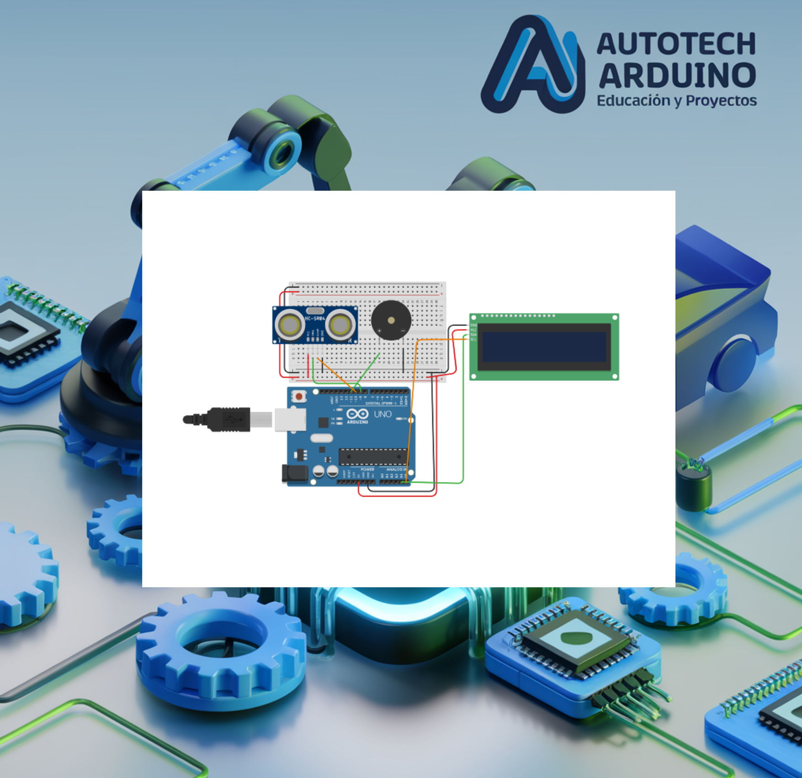

# 🚗 Sensores de Estacionamiento con Arduino y Pantalla LCD 📟

¡Lleva la tecnología automotriz a tus proyectos! En esta entrega de nivel avanzado, vamos a construir un **Sistema de Sensores de Estacionamiento**. Este dispositivo utiliza un sensor ultrasónico para medir la distancia a un obstáculo, la muestra en tiempo real en una pantalla LCD y activa una alerta sonora (Buzzer) cuando el objeto está demasiado cerca. ¡Es el mismo principio que utilizan los autos modernos para ayudar a estacionar! 🚀

**Aprende a integrar sensores ultrasónicos con pantallas LCD I2C para crear un sistema de medición y alerta sonora profesional.**

## Introducción al Proyecto

El sistema de asistencia de estacionamiento es un excelente ejercicio para aprender sobre la retroalimentación en tiempo real. En este proyecto, practicarás la comunicación I2C para controlar pantallas LCD, la medición de precisión con ultrasonido y la creación de alarmas basadas en umbrales de seguridad. ¡Ideal para mejorar tus habilidades en sistemas de monitoreo!

## Componentes Necesarios

Para realizar este proyecto, necesitarás:

*   1 x Arduino Uno
*   1 x Sensor Ultrasónico HC-SR04
*   1 x Pantalla LCD 16x2 con Módulo I2C
*   1 x Buzzer pasivo o activo
*   1 x Protoboard
*   Cables de conexión

## Todos los materiales necesarios los encontrarás en los siguientes enlaces:

*   [Kit de Arduino Uno R3 - Incluye todo lo necesario](https://amzn.to/4dQTpkX)
*   [Kit de módulos de sensores y componentes - Compatible con Arduino](https://amzn.to/3yGZIsk)

## Configuración del Circuito

### Diagrama de Conexión

### Conexiones de Control:

*   **Sensor Ultrasónico:** Trigger al **Pin 9**, Echo al **Pin 10**.
*   **Pantalla LCD I2C:** SDA al **Pin A4**, SCL al **Pin A5** (o pines SDA/SCL dedicados). VCC a 5V y GND a GND.
*   **Buzzer:** Positivo al **Pin 11**, Negativo a **GND**.

## Código del Sistema de Estacionamiento

Copia el siguiente código en tu Arduino IDE. Asegúrate de tener instalada la librería `LiquidCrystal_I2C`.

    <button onclick="copyCode()" style="background-color: #007BFF; color: white; padding: 10px 20px; border: none; cursor: pointer; position: absolute; right: 10px; top: 10px; border-radius: 5px; font-weight: bold;">Copiar Código</button>
    <pre id="codeContent" style="margin-top: 40px; overflow-x: auto;"><code>
#include &lt;Wire.h&gt;
#include &lt;LiquidCrystal_I2C.h&gt;

// Configuración del sensor ultrasónico
#define TRIGGER_PIN 9
#define ECHO_PIN 10
#define MAX_DISTANCE 200

// Configuración del buzzer
#define BUZZER_PIN 11

// Configuración de la pantalla LCD I2C (dirección 0x27)
LiquidCrystal_I2C lcd(0x27, 16, 2);

void setup() {
  lcd.init();
  lcd.backlight();
  lcd.setCursor(0, 0);
  lcd.print("Distancia:");

  pinMode(TRIGGER_PIN, OUTPUT);
  pinMode(ECHO_PIN, INPUT);
  pinMode(BUZZER_PIN, OUTPUT);

  Serial.begin(9600);
}

void loop() {
  digitalWrite(TRIGGER_PIN, LOW);
  delayMicroseconds(2);
  digitalWrite(TRIGGER_PIN, HIGH);
  delayMicroseconds(10);
  digitalWrite(TRIGGER_PIN, LOW);

  long duration = pulseIn(ECHO_PIN, HIGH);
  int distance = duration * 0.034 / 2;

  lcd.setCursor(0, 1);
  if (distance == 0 || distance &gt;= 200) {
    lcd.print("Fuera de rango   ");
  } else {
    lcd.print(distance);
    lcd.print(" cm           ");
  }

  Serial.print("Distancia: ");
  Serial.print(distance);
  Serial.println(" cm");

  // Alerta si la distancia es menor a 25 cm
  if (distance &gt; 0 && distance &lt;= 25) {
    digitalWrite(BUZZER_PIN, HIGH);
  } else {
    digitalWrite(BUZZER_PIN, LOW);
  }

  delay(100);
}
</code></pre>

## Explicación de la Lógica

1.  **Comunicación I2C**: Utilizamos solo dos cables (SDA y SCL) para controlar los 16 caracteres de la pantalla, lo que ahorra muchos pines en nuestro Arduino.
2.  **Cálculo de Distancia**: La velocidad del sonido (0.034 cm/us) nos permite convertir el tiempo de viaje del pulso en una medida de distancia precisa.
3.  **Visualización**: El código limpia y actualiza la segunda fila de la LCD con el valor medido, añadiendo espacios al final para evitar que queden dígitos "fantasma" de lecturas previas.
4.  **Sistema de Alarma**: Un umbral de 25 cm activa el buzzer. A diferencia de un auto real que pita intermitente, este código usa un pitido continuo por simplicidad, pero ¡puedes mejorarlo!

## Problemas Comunes y Soluciones

*   **La pantalla LCD no muestra texto:** Ajusta el contraste girando el potenciómetro azul que se encuentra en la parte trasera del módulo I2C.
*   **Lecturas de "0 cm" constantes:** Revisa que el sensor ultrasónico no tenga obstáculos justo enfrente y que los pines Echo/Trigger no estén intercambiados.
*   **El buzzer no suena:** Verifica su polaridad (la pata más larga es el positivo).

## Desafío para el Alumno

¿Cómo podrías hacer que el buzzer suene de forma intermitente (bi-bi-bi) y que la velocidad del pitido aumente a medida que el auto se acerca al objeto? ¡Es el siguiente nivel de realismo!

<button onclick="toggleAnswer()" style="margin-top: 10px; background-color: #007BFF; color: white; padding: 10px; border: none; cursor: pointer; border-radius: 5px; font-weight: bold;">Mostrar Solución</button>

    
Puedes usar la función <code>delay</code> proporcional a la distancia dentro del condicional de alerta:

    <pre id="solutionCodeContent" style="background-color: #f8f9fa; padding: 10px; border-radius: 5px; border: 1px solid #eee;"><code>
if (distance &gt; 0 && distance &lt;= 25) {
  digitalWrite(BUZZER_PIN, HIGH);
  delay(distance * 10); // Más cerca, delay más corto
  digitalWrite(BUZZER_PIN, LOW);
  delay(distance * 10);
}
</code></pre>
    <button onclick="copySolutionCode()" style="background-color: #007BFF; color: white; padding: 8px 16px; border: none; cursor: pointer; border-radius: 5px; margin-top: 10px; font-weight: bold;">Copiar Código de Solución</button>

¡Esperamos que este proyecto te sea de gran utilidad para tus prototipos! La seguridad es clave, y con Arduino, ¡está en tus manos! 🚀

