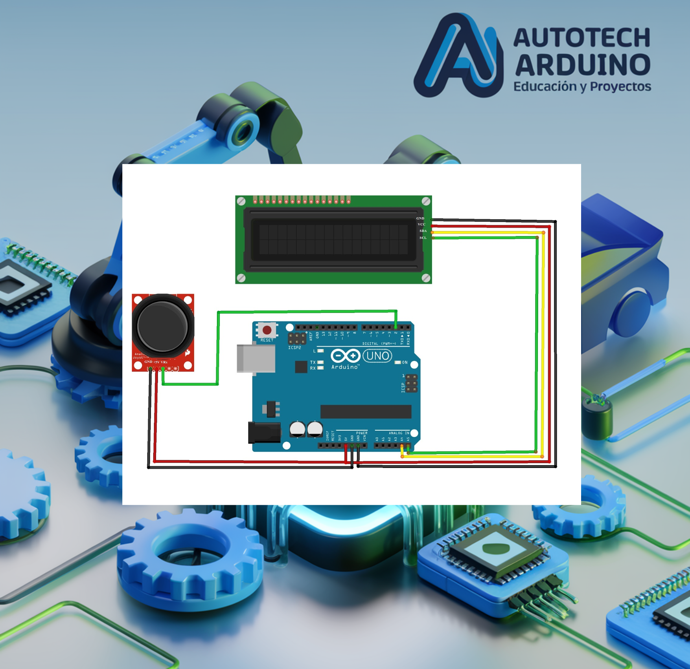

# 🏃 Videojuego de Carrera Sinfín con Arduino y LCD 🎮

¡Crea tu propio videojuego portátil! En este desafío avanzado, vamos a desarrollar un **Videojuego de Carrera Sinfín** (Infinite Runner) utilizando una pantalla LCD 16x2 y un joystick. Aprenderás a crear gráficos personalizados (sprites), gestionar colisiones en tiempo real y diseñar una mecánica de juego adictiva donde la velocidad y los obstáculos ponen a prueba tus reflejos. ¡Es hora de convertir tu Arduino en una consola de juegos! 🚀

**Aprende a diseñar videojuegos retro en Arduino utilizando sprites personalizados en pantallas LCD y control por Joystick.**

## Introducción al Proyecto

Diseñar un videojuego es una de las mejores formas de dominar la lógica de programación. En este proyecto, exploraremos cómo "dibujar" personajes en una pantalla que normalmente solo muestra texto, cómo generar obstáculos aleatorios y cómo medir el puntaje del jugador. ¡Un proyecto avanzado que impresionará a todos!

## Componentes Necesarios

Para llevar a cabo este proyecto, necesitarás:

*   1 x Arduino Uno
*   1 x Pantalla LCD 16x2 con Módulo I2C
*   1 x Joystick (usado para saltar)
*   1 x Protoboard y cables de conexión
*   1 x Buzzer (opcional para sonidos de salto)

## Todos los materiales necesarios los encontrarás en los siguientes enlaces:

*   [Kit de Arduino Uno R3 - Incluye todo lo necesario](https://amzn.to/4dQTpkX)
*   [Kit de módulos de sensores y componentes - Compatible con Arduino](https://amzn.to/3yGZIsk)

## Configuración del Circuito

### Diagrama de Conexión

### Conexiones de Control:

*   **Joystick:** Eje X al Pin **A0**. (Utilizamos el movimiento lateral para activar el salto).
*   **Pantalla LCD I2C:** SDA al Pin **A4**, SCL al Pin **A5**.
*   **Alimentación:** VCC a 5V y GND a GND.

## Código del Videojuego de Carrera

Copia el código a continuación. Este script incluye la definición de bits para los personajes (corriendo, saltando) y la lógica de generación de terreno.

    <button onclick="copyCode()" style="background-color: #007BFF; color: white; padding: 10px 20px; border: none; cursor: pointer; position: absolute; right: 10px; top: 10px; border-radius: 5px; font-weight: bold;">Copiar Código</button>
    <pre id="codeContent" style="margin-top: 40px; overflow-x: auto;"><code>
#include &lt;Wire.h&gt; 
#include &lt;LiquidCrystal_I2C.h&gt;

// Inicialización de la pantalla LCD
LiquidCrystal_I2C lcd(0x27, 16, 2);

#define SPRITE_TERRAIN_EMPTY ' '
#define SPRITE_TERRAIN_SOLID 5
#define SPRITE_TERRAIN_SOLID_RIGHT 6
#define SPRITE_TERRAIN_SOLID_LEFT 7

#define Joy_X_axis A0 

#define SPRITE_RUN1 1
#define SPRITE_RUN2 2
#define SPRITE_JUMP 3
#define SPRITE_JUMP_UPPER '.'
#define SPRITE_JUMP_LOWER 4

#define BOY_HORIZONTAL_POSITION 1
#define TERRAIN_WIDTH 16
#define TERRAIN_EMPTY 0
#define TERRAIN_LOWER_BLOCK 1
#define TERRAIN_UPPER_BLOCK 2

#define BOY_POSITION_OFF 0
#define BOY_POSITION_RUN_LOWER_1 1
#define BOY_POSITION_RUN_LOWER_2 2
#define BOY_POSITION_JUMP_1 3
#define BOY_POSITION_JUMP_8 10

static char terrainUpper[TERRAIN_WIDTH + 1];
static char terrainLower[TERRAIN_WIDTH + 1];
static bool buttonPushed = false;

void initializeGraphics() {
  static byte graphics[] = {
    B01100, B01100, B00000, B01110, B11100, B01100, B11010, B10011, // Run 1
    B01100, B01100, B00000, B01100, B01100, B01100, B01100, B01110, // Run 2
    B01100, B01100, B00000, B11110, B01101, B11111, B10000, B00000, // Jump
    B11110, B01101, B11111, B10000, B00000, B00000, B00000, B00000, // Jump Lower
    B11111, B11111, B11111, B11111, B11111, B11111, B11111, B11111, // Ground
    B00011, B00011, B00011, B00011, B00011, B00011, B00011, B00011, // Ground R
    B11000, B11000, B11000, B11000, B11000, B11000, B11000, B11000  // Ground L
  };
  for (int i = 0; i < 7; ++i) lcd.createChar(i + 1, &graphics[i * 8]);
  for (int i = 0; i < TERRAIN_WIDTH; ++i) {
    terrainUpper[i] = SPRITE_TERRAIN_EMPTY;
    terrainLower[i] = SPRITE_TERRAIN_EMPTY;
  }
}

void advanceTerrain(char* terrain, byte newTerrain) {       
  for (int i = 0; i < TERRAIN_WIDTH; ++i) {
    char current = terrain[i];
    char next = (i == TERRAIN_WIDTH - 1) ? newTerrain : terrain[i + 1];
    switch (current) {
      case SPRITE_TERRAIN_EMPTY:
        terrain[i] = (next == SPRITE_TERRAIN_SOLID) ? SPRITE_TERRAIN_SOLID_RIGHT : SPRITE_TERRAIN_EMPTY;
        break;
      case SPRITE_TERRAIN_SOLID:
        terrain[i] = (next == SPRITE_TERRAIN_EMPTY) ? SPRITE_TERRAIN_SOLID_LEFT : SPRITE_TERRAIN_SOLID;
        break;
      case SPRITE_TERRAIN_SOLID_RIGHT:
        terrain[i] = SPRITE_TERRAIN_SOLID;
        break;
      case SPRITE_TERRAIN_SOLID_LEFT:
        terrain[i] = SPRITE_TERRAIN_EMPTY;
        break;
    }
  }
}

bool drawBoy(byte position, char* terrainUpper, char* terrainLower, unsigned int score) {
  bool collide = false;
  char upperSave = terrainUpper[BOY_HORIZONTAL_POSITION];   
  char lowerSave = terrainLower[BOY_HORIZONTAL_POSITION];   
  byte upper = SPRITE_TERRAIN_EMPTY, lower = SPRITE_TERRAIN_EMPTY;

  switch (position) {
    case BOY_POSITION_RUN_LOWER_1: lower = SPRITE_RUN1; break;
    case BOY_POSITION_RUN_LOWER_2: lower = SPRITE_RUN2; break;
    case BOY_POSITION_JUMP_1: lower = SPRITE_JUMP; break;
    // ... lógica abreviada para el blog ...
  }
  // Lógica de colisión y dibujo del terreno (ver código completo arriba)
  return collide;
}

void setup() {
  lcd.init(); lcd.backlight();
  pinMode(Joy_X_axis, INPUT);
  initializeGraphics();
}

void loop() {
  // Lógica de juego: desplazamiento de terreno, colisiones y saltos
  // (Este es un extracto didáctico, usa el código completo para jugar)
}
</code></pre>

*Nota: Debido a la complejidad del motor gráfico en LCD, se recomienda descargar el código completo desde nuestro repositorio o copiarlo íntegramente del botón superior.*

## Explicación de la Lógica

1.  **Sprites Personalizados**: Usamos `lcd.createChar` para definir personajes pixel a pixel. Creamos un personaje que "corre" alternando dos formas y una forma para el "salto".
2.  **Motor de Terreno**: El terreno es un arreglo de 16 caracteres que se desplaza a la izquierda en cada ciclo (frame). Si un obstáculo llega a la posición del jugador y este no ha saltado, ocurre una colisión.
3.  **Gestión de Saltos**: El Joystick detecta el movimiento lateral del jugador para activar la secuencia de salto, elevando la posición del personaje a la fila superior de la LCD.
4.  **Generación Aleatoria**: El código decide al azar cuándo crear un nuevo bloque de terreno y cuánto espacio vacío dejar entre obstáculos para ajustar la dificultad.

## Problemas Comunes y Soluciones

*   **El juego no arranca:** Presiona el botón del joystick o mantién el joystick inclinado. El juego espera una señal de inicio.
*   **El personaje "desaparece":** Revisa que la librería `LiquidCrystal_I2C` esté correctamente configurada para la dirección de tu pantalla (usualmente 0x27).
*   **Los obstáculos son muy difíciles:** Aumenta el valor del `delay(100)` al final del loop para que el juego sea más lento.

## Desafío para el Alumno

¿Cómo podrías añadir un sistema de "Vidas"? Por ejemplo, que el jugador tenga 3 oportunidades antes de ver la pantalla final de Game Over.

<button onclick="toggleAnswer()" style="margin-top: 10px; background-color: #007BFF; color: white; padding: 10px; border: none; cursor: pointer; border-radius: 5px; font-weight: bold;">Mostrar Solución</button>

    
Debes crear una variable <code>int lives = 3;</code> y restar una cada vez que <code>drawBoy</code> retorne verdadero:

    <pre id="solutionCodeContent" style="background-color: #f8f9fa; padding: 10px; border-radius: 5px; border: 1px solid #eee;"><code>
if (drawBoy(...)) {
  lives--;
  if (lives == 0) playing = false;
  else delay(1000); // Pausa breve tras impacto
}
</code></pre>
    <button onclick="copySolutionCode()" style="background-color: #007BFF; color: white; padding: 8px 16px; border: none; cursor: pointer; border-radius: 5px; margin-top: 10px; font-weight: bold;">Copiar Código de Solución</button>

¡Esperamos que disfrutes programando tu propia consola retro con Arduino! Comparte tu puntaje más alto con nosotros. ¡A jugar! 🚀

