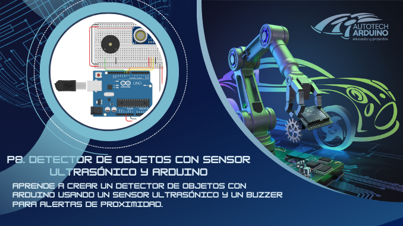

# 📡 Detector de Objetos con Sensor Ultrasónico y Arduino 🚧

¡Hola a todos los entusiastas de la electrónica! En este emocionante proyecto, construiremos un "**Detector de Objetos con Sensor Ultrasónico**". Este proyecto es perfecto para quienes se inician en el mundo de Arduino y quieren aprender sobre la detección de distancias y cómo responder ante la proximidad de objetos. Utilizaremos un **sensor ultrasónico** para medir distancias y un **buzzer** que emitirá un sonido cuando un objeto se acerque demasiado. ¡Vamos a construirlo! 🎶🔨

**Aprende a crear un detector de objetos con Arduino usando un sensor ultrasónico y un buzzer para alertas de proximidad.**

## Enlace al Proyecto en Tinkercad - Detector de Objetos

Explora cómo funciona este proyecto y experimenta con el circuito interactivo en Tinkercad. Haz clic en el siguiente enlace para acceder: [Detector de Objetos - Proyecto en Tinkercad](https://www.tinkercad.com/things/0CjVj8OdR0E-proyecto-nivel-principiante-detector-de-objetos-con-sensor).

## Componentes Necesarios

Para llevar a cabo este proyecto, necesitaremos los siguientes componentes:

*   1 x Arduino Uno
*   1 x Sensor Ultrasónico HC-SR04
*   1 x Buzzer
*   Cables de Conexión
*   1 x Protoboard
*   Fuente de Alimentación (USB de PC o batería externa)

## Todos los materiales necesarios los encontrarás en los siguientes enlaces:

*   [Kit de Arduino Uno R3 - Incluye todo lo necesario](https://amzn.to/4dQTpkX)
*   [Kit de módulos de sensores y componentes - Compatible con Arduino](https://amzn.to/3yGZIsk)

## Configuración del Circuito

### Diagrama de Conexión

### Conexiones:

*   **Sensor Ultrasónico HC-SR04:**
    *   Conectar el pin VCC del sensor a 5V de Arduino.
    *   Conectar el pin GND del sensor a GND de Arduino.
    *   Conectar el pin TRIG del sensor al pin 8 de Arduino.
    *   Conectar el pin ECHO del sensor al pin 9 de Arduino.
*   **Buzzer:**
    *   Conectar el pin positivo del buzzer al pin 10 de Arduino.
    *   Conectar el pin negativo del buzzer a GND de Arduino.

## Código para Controlar el Detector de Objetos con Arduino

¡Aquí tienes el código completo! Puedes copiarlo fácilmente haciendo clic en el botón "Copiar Código".

    <button onclick="copyCode()" style="background-color: #007BFF; color: white; padding: 10px 20px; border: none; cursor: pointer; position: absolute; right: 10px; top: 10px; border-radius: 5px; font-weight: bold;">Copiar Código</button>
    <pre id="codeContent" style="margin-top: 40px; overflow-x: auto;"><code>
// Definición de pines
const int trigPin = 8;  // Pin de TRIG del sensor ultrasónico
const int echoPin = 9;  // Pin de ECHO del sensor ultrasónico
const int buzzerPin = 10;  // Pin del buzzer

// Variables
long duration;  // Duración del pulso del sensor ultrasónico
int distance;  // Distancia calculada del objeto

void setup() {
  // Configuración de los pines del sensor ultrasónico
  pinMode(trigPin, OUTPUT);
  pinMode(echoPin, INPUT);
  
  // Configuración del pin del buzzer
  pinMode(buzzerPin, OUTPUT);

  Serial.begin(9600);  // Iniciar la comunicación serie para la depuración
}

void loop() {
  // Enviar un pulso ultrasónico
  digitalWrite(trigPin, LOW);
  delayMicroseconds(2);
  digitalWrite(trigPin, HIGH);
  delayMicroseconds(10);
  digitalWrite(trigPin, LOW);
  
  // Leer la duración del pulso de retorno
  duration = pulseIn(echoPin, HIGH);
  
  // Calcular la distancia en cm
  distance = duration * 0.034 / 2;

  // Mostrar la distancia en el monitor serie
  Serial.print("Distancia al objeto: ");
  Serial.print(distance);
  Serial.println(" cm");

  // Activar el buzzer si la distancia es menor o igual a 15 cm
  if (distance <= 15) {
    tone(buzzerPin, 1000);  // Emitir un tono a 1000 Hz
    Serial.println("Objeto cercano - Alerta de buzzer!");
  } else {
    noTone(buzzerPin);  // Apagar el buzzer
  }

  delay(500);  // Esperar 500 ms antes de la siguiente lectura
}
</code></pre>

## Explicación del Código

A continuación, explicamos cada línea del código para ayudarte a comprender su funcionamiento y a desarrollar un pensamiento crítico sobre su estructura y lógica:

1.  **Sensor Ultrasónico (HC-SR04):** Utiliza los pines 8 (TRIG) y 9 (ECHO) de Arduino para enviar y recibir pulsos de ultrasonido que miden la distancia.
2.  **Buzzer:** Conectado al pin 10, emite un sonido de alerta cuando la distancia medida es menor o igual a 15 cm.
3.  **Medición de Distancia:** El sensor ultrasónico envía un pulso de sonido y mide el tiempo que tarda en regresar. Esta duración se utiliza para calcular la distancia al objeto utilizando la fórmula `distance = duration * 0.034 / 2`.
4.  **Alerta de Proximidad:** Si la distancia es menor o igual a 15 cm, el buzzer emite un tono de 1000 Hz como advertencia. De lo contrario, el buzzer permanece apagado.

## Problemas Comunes y Soluciones

*   **El sensor ultrasónico no detecta distancias:** Verifica que los pines TRIG y ECHO estén conectados correctamente y que el sensor esté alimentado.
*   **El buzzer no emite sonido:** Asegúrate de que el buzzer esté conectado correctamente al pin 10 de Arduino y que el código esté configurado para emitir tonos.
*   **Lecturas inexactas de distancia:** Asegúrate de que no haya objetos cerca del sensor que puedan interferir con la medición. También, considera agregar un promedio de lecturas para mejorar la precisión.

## Desafío para el Usuario

¿Cómo podrías modificar el proyecto para que el buzzer emita diferentes tonos dependiendo de la proximidad del objeto? ¡Déjanos tu idea en los comentarios!

<button onclick="toggleAnswer()" style="margin-top: 10px; background-color: #007BFF; color: white; padding: 10px; border: none; cursor: pointer; border-radius: 5px; font-weight: bold;">Mostrar Solución</button>

    
Podrías utilizar la función <code>tone()</code> con diferentes frecuencias según la distancia. Por ejemplo, a 10 cm, 15 cm y 20 cm, el buzzer podría emitir tonos de 800 Hz, 1000 Hz y 1200 Hz respectivamente.

    <pre id="solutionCodeContent" style="background-color: #f8f9fa; padding: 10px; border-radius: 5px; border: 1px solid #eee;"><code>
// Modificación para emitir diferentes tonos según la distancia

void loop() {
  digitalWrite(trigPin, LOW);
  delayMicroseconds(2);
  digitalWrite(trigPin, HIGH);
  delayMicroseconds(10);
  digitalWrite(trigPin, LOW);
  
  duration = pulseIn(echoPin, HIGH);
  distance = duration * 0.034 / 2;

  Serial.print("Distancia al objeto: ");
  Serial.print(distance);
  Serial.println(" cm");

  if (distance <= 10) {
    tone(buzzerPin, 1200);  // Tono de 1200 Hz para menos de 10 cm
  } else if (distance <= 15) {
    tone(buzzerPin, 1000);  // Tono de 1000 Hz para menos de 15 cm
  } else if (distance <= 20) {
    tone(buzzerPin, 800);   // Tono de 800 Hz para menos de 20 cm
  } else {
    noTone(buzzerPin);  // Apagar el buzzer si la distancia es mayor a 20 cm
  }

  delay(500);  // Esperar 500 ms antes de la siguiente lectura
}
</code></pre>
    <button onclick="copySolutionCode()" style="background-color: #007BFF; color: white; padding: 8px 16px; border: none; cursor: pointer; border-radius: 5px; margin-top: 10px; font-weight: bold;">Copiar Código de Solución</button>

¡Espero que disfrutes creando este proyecto tanto como yo disfruto compartiéndolo contigo! Recuerda que la práctica hace al maestro, así que sigue experimentando y adaptando este código a nuevas ideas. ¡Nos encantaría ver tus creaciones! 🚀

Si te ha gustado este artículo, por favor compártelo y suscríbete a nuestro blog para más proyectos interesantes. ¡Hasta la próxima aventura tecnológica!

